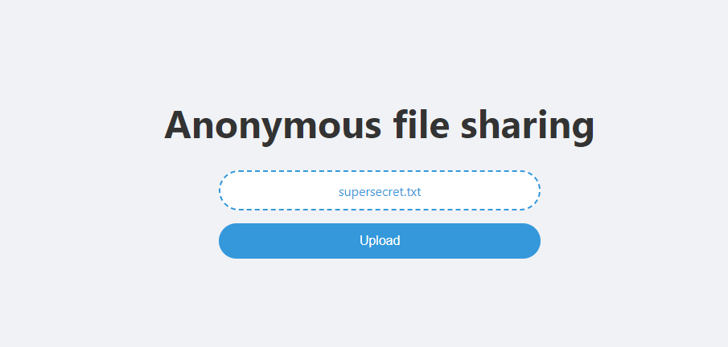
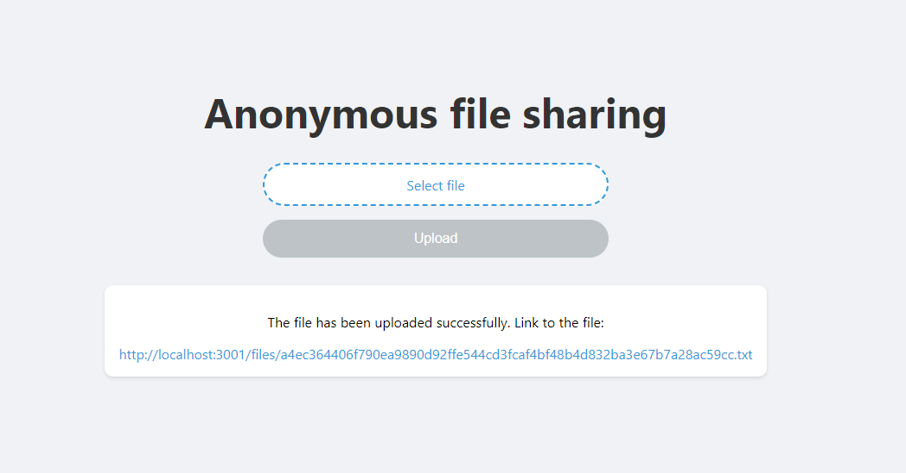

# Anonymous file sharing
Share your files anonymously! Made with NextJS and ExpressJS.

<details>
<summary>Installing the client part</summary>

```bash
cd Client
npm i
npm run dev
```

</details>

<details>
<summary>Installing the server part</summary>

```bash
cd Server
npm i
npm run dev
```

</details>
<br>



